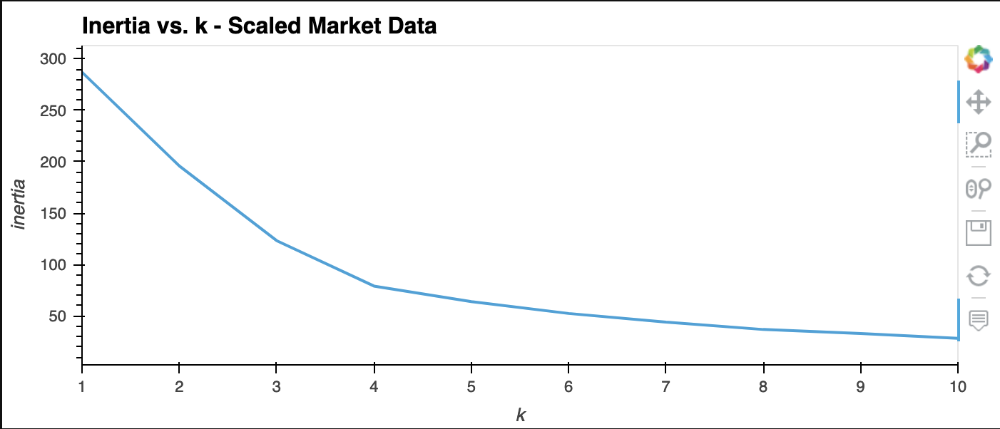
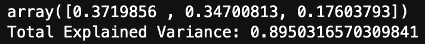
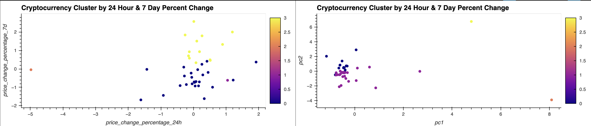

# Cryptocurrency Clustering Analysis

This analysis conducts preliminary data cleaning, principal component analysis (PCA), and clustering analysis using K-Means to expose latent patterns in the cryptocurrency dataset.


## Technologies

This analysis leverages python 3.7 with the following packages:

- [pandas](https://pandas.pydata.org/) - For analyzing and transforming data  
- [scikit-learn](https://scikit-learn.org/stable/index.html) - For building ML models
- [pyviz](https://pyviz.org/) - For visualizing data 
- [holoviews](http://holoviews.org/) - For creating interactive plots
- [jupyter](https://jupyter.org/) - For an IDE


## Installation Guide

Before running the application first install the following dependencies.

```python
  pip install pandas
  pip install scikit-learn
  pip install pyviz
  pip install hvplot
  pip install jupyterlab
```


## Usage

Because the analysis leverages HoloViews the plots do not render when viewed from GitHub. To view the analysis and interact with the plots clone the repository and after ensuring all required packages have been installed run `jupyter lab` from the directory where the notebook is stored.

For a snapshot of the analysis several images have been provided. In bold above the plot image is the cell output that the image is associated with in `crypto_investments.ipynb`

**Out[9]:**
  

**In  [15]:**
  

**Out[24]:**
  


## Contributors
Josh Mischung: [josh@knoasis.io](josh@knoasis.io), [LinkedIn](https://www.linkedin.com/in/joshmischung/)


## License

MIT License

Copyright (c) [2022] [Joshua Mischung]

Permission is hereby granted, free of charge, to any person obtaining a copy
of this software and associated documentation files (the "Software"), to deal
in the Software without restriction, including without limitation the rights
to use, copy, modify, merge, publish, distribute, sublicense, and/or sell
copies of the Software, and to permit persons to whom the Software is
furnished to do so, subject to the following conditions:

The above copyright notice and this permission notice shall be included in all
copies or substantial portions of the Software.

THE SOFTWARE IS PROVIDED "AS IS", WITHOUT WARRANTY OF ANY KIND, EXPRESS OR
IMPLIED, INCLUDING BUT NOT LIMITED TO THE WARRANTIES OF MERCHANTABILITY,
FITNESS FOR A PARTICULAR PURPOSE AND NONINFRINGEMENT. IN NO EVENT SHALL THE
AUTHORS OR COPYRIGHT HOLDERS BE LIABLE FOR ANY CLAIM, DAMAGES OR OTHER
LIABILITY, WHETHER IN AN ACTION OF CONTRACT, TORT OR OTHERWISE, ARISING FROM,
OUT OF OR IN CONNECTION WITH THE SOFTWARE OR THE USE OR OTHER DEALINGS IN THE
SOFTWARE.
